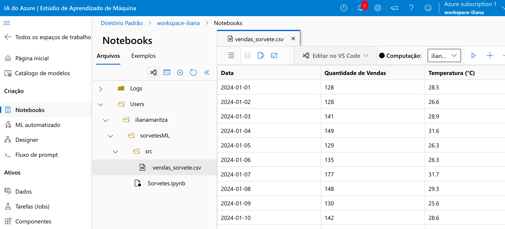

## 📊 Projeto: Previsão de Vendas de Sorvete com Azure Machine Learning

Este projeto tem como objetivo prever a quantidade de sorvetes vendidos diariamente em uma sorveteria chamada **Gelato Mágico**, localizada em uma cidade litorânea. O modelo de regressão é baseado na **temperatura ambiente**, utilizando o **Microsoft Azure Machine Learning**.

---

### 📁 Dataset

O dataset contém 100 linhas com as seguintes colunas:
- `Data`: data da observação (formato YYYY-MM-DD)
- `Quantidade de Vendas`: número de sorvetes vendidos no dia
- `Temperatura`: temperatura média diária (°C)

O arquivo CSV está nomeado como `vendas_sorvete.csv`.

---

### 🚀 Etapas no Azure Machine Learning

#### 1. Upload dos Dados
- Acesse o **Azure Machine Learning Studio**.
- Vá para o menu: `Datasets > + Create Dataset > From local files`.
- Envie o arquivo `vendas_sorvete.csv`.
- Escolha o tipo **Tabular** e revise o esquema:
  - `Data` → tipo **Date**
  - `Quantidade de Vendas` → tipo **Integer**
  - `Temperatura` → tipo **Float**

#### 2. Criação da Instância de Computação
- No menu `Compute`, crie uma **instância de CPU** e um **cluster de computação** para executar os experimentos.
- Siga os parâmetros sugeridos no [vídeo de referência](#) 

#### 3. Criação do Experimento
- Use o **Designer** no Azure ML para montar o pipeline graficamente.
- Arraste os blocos de pré-processamento, treinamento e avaliação.

#### 4. Treinamento com AutoML
- Navegue até: `Automated ML > New Automated ML Run`.
- Selecione o dataset `vendas_sorvete.csv`.
- Defina `Quantidade de Vendas` como variável **target**.
- Tipo de tarefa: **Regressão**.
- O Azure testará automaticamente diferentes algoritmos e configurará o melhor modelo.

#### 5. [⚠️] Interrupção do Processo
A partir dessa etapa, não foi possível concluir o projeto por falhas de execução. Pretende-se retomar o processo posteriormente, resolvendo os problemas de configuração do ambiente.

---
